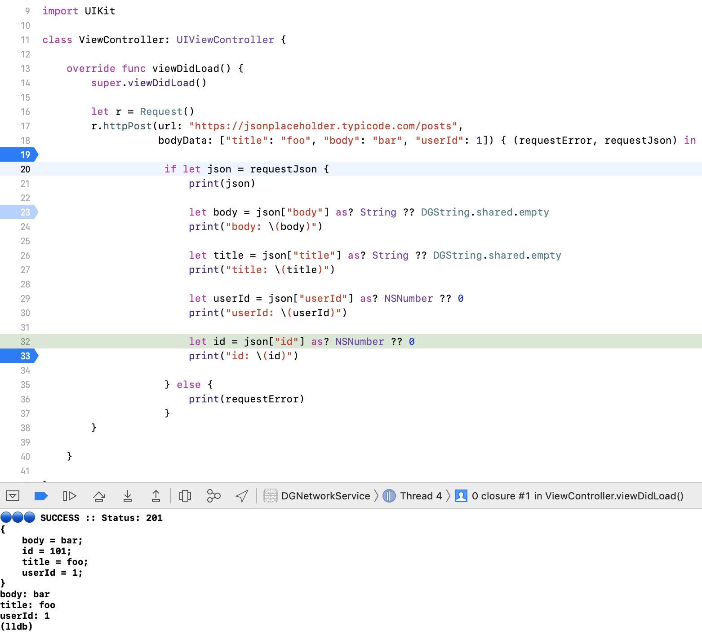
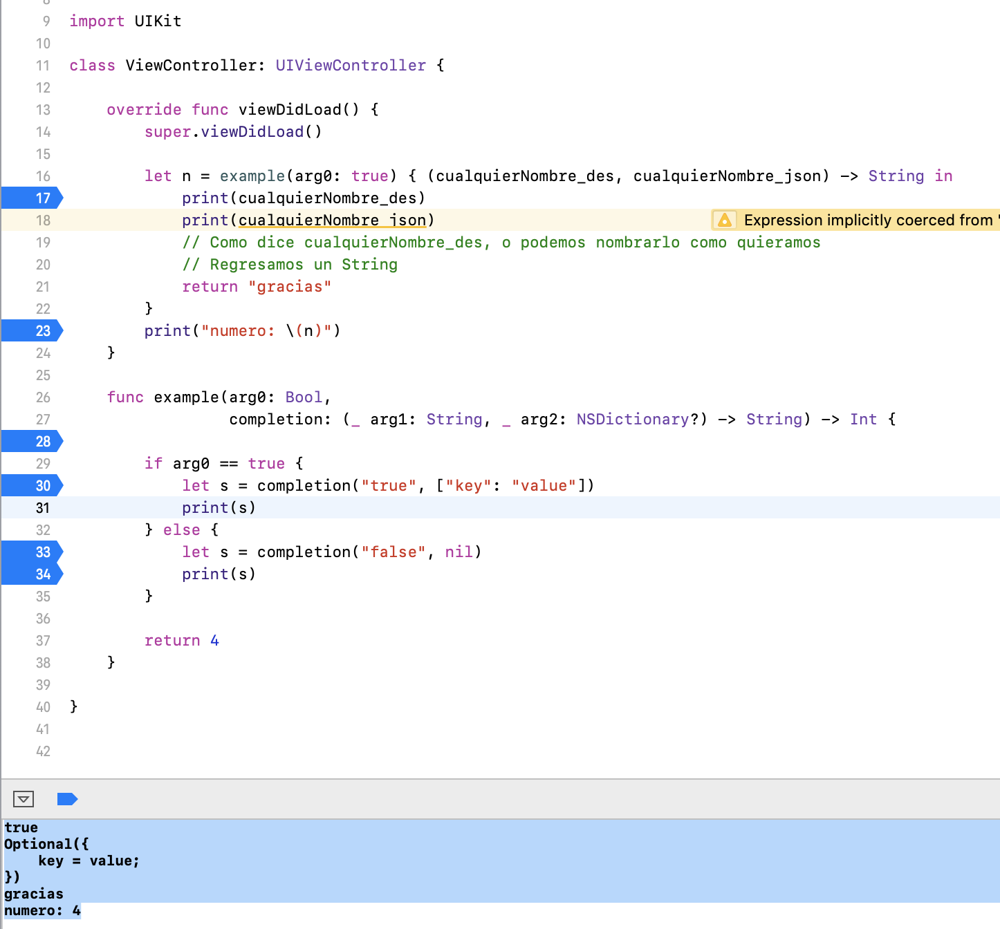

Consumo De Servicios Con Callbacks Swift
===

<p align="center">
	
</p>

### 1. Desarrollo

##### 1.1 Utilidades

Primero necesitamos un par de herramientas. Creamos la classe <i>DGHttpMethods</i>:

Los métodos de http para consumo de servicios.

```swift
public class DGHttpMethods: NSObject {
    public class var GET: String {
        return "GET"
    }
    public class var POST: String {
        return "POST"
    }
}
```

Así también creamos la clase <i>DGUtilities</i>:

Un tiempo de espera máximo en segundos, para que responda el servicio. Y cabeceras básicas para un consumo de servicios REST.

```swift
public class DGUtilities: NSObject {
    
    public class var TimeOutInterval: TimeInterval {
        return 30.0
    }
    
    public class var BasicHeaderFields: [String: String] {
        return ["Accept": "application/json",
                "Content-Type": "application/json"]
    }
}
```

Por último creamos un Singleton para reusar la instancía de cadena vacía.

```swift
class DGString {
    
    // Can't init is singleton
    private init() { }
    
    // MARK: Shared Instance
    static let shared = DGString()
    
    // MARK: Local Variable
    var empty = ""
}
```

##### 1.2 Construcción de las capas Request y Submit.

Request es el objeto que contiene nuestra petición. Contiene que método http usaremos, que cabeceras, que cuerpo, cual url, etc.

Y Submit es la capa superior que envia el Request, a través de librerías nativas.

##### 1.2.1 Request

```swift
class Request: Submit {
    
    private func buildRequest(url: String,
                              method: String,
                              extraHeaders: [String: String]? = nil,
                              bodyData: Any? = nil)
        -> URLRequest? {
        
        if let nsurl = URL(string: url) {
            var request = URLRequest(url: nsurl)
            
            if method == DGHttpMethods.POST {
                do {
                    request.httpBody = try JSONSerialization.data(withJSONObject: bodyData ?? [], options: [])
                }
                catch let error {
                    print("🔶🔶🔶 Warning :: No se puede castear el body a json...\n body se envía como nil -> commonHttpRest: \(error)")
                    request.httpBody = nil
                }
            }
            
            request.httpMethod          = method
            request.timeoutInterval     = DGUtilities.TimeOutInterval
            request.allHTTPHeaderFields = DGUtilities.BasicHeaderFields
            
            if let headers = extraHeaders, headers.count > 0 {
                for (key, value) in headers {
                    request.addValue(value, forHTTPHeaderField: key)
                }
            }
            
            return request
        }
            
        return nil
    }
    
    internal func httpGet(url: String,
                 extraHeaders: [String: String]? = nil,
                 completion: @escaping (_ error: String, _ json: NSDictionary?) -> Void)
        -> Void {
        
        let requestGet = buildRequest(url: url, method: DGHttpMethods.GET, extraHeaders: extraHeaders)
        
        if let request = requestGet {
            submit(request: request) { (submitError, submitJson) in
                completion(submitError, submitJson)
            }
        } else {
            completion("🔴🔴🔴 ERROR :: Error al crear el Request, posiblemente la urlString sea inválida!!", nil)
        }
    }
    
    internal func httpPost(url: String,
                  extraHeaders: [String: String]? = nil,
                  bodyData: Any? = nil,
                  completion: @escaping (_ error: String, _ json: NSDictionary?) -> Void)
        -> Void {
        
        let requestPost = buildRequest(url: url, method: DGHttpMethods.POST, extraHeaders: extraHeaders, bodyData: bodyData)
        
        if let request = requestPost {
            submit(request: request) { (submitError, submitJson) in
                completion(submitError, submitJson)
            }
        } else {
            completion("🔴🔴🔴 ERROR :: Error al crear el Request, posiblemente la urlString sea inválida!!", nil)
        }
    }
    
}
```

Podemos observar 3 funciones. Para las dos primeras, <i>httpPost</i> y <i>httpGet</i> obtienen como parametros una URL como string, cabeceras extra a parte de las básicas (que nos otros le agregamos por defecto por si lo llegan a necesitar), un <i>body</i> si es una petición <i>post</i> y por último vemos un <i>completion</i> el cual será de utilidad para alguien que invoqué la función, pues regresará la respuesta dentro de la misma función. Dentro del completion, un error en caso de que exista y un json que será la respuesta del servicio solicitado. 

En la implementación vemos que se auxilia de una funcion <i>buildRequest</i> para construir el request, y posterior a eso invoca a otra función <i>submit</i> la cual la obtiene heredando. La función submite tiene su propio completion que contiene un error en caso de que exista y un json, mismos que seran usados en una capa inferior por el usuario.

Por último para la tercer la función <i>buildRequest</i>, construye un rquest, de diversos componentes, el primero una url a partir del string que le pasamos, un request vacio que complementa con un body en caso de que el método sea POST, también asigna el método http que usará, el tiempo de respuesta máximo, las cabeceras por defecto, en caso de contener cabeceras extra se las agrega y regresa el request construido.

##### 1.2.2 Submit

Esta es la capa superior y es la que contiene los métodos nativos para el envio del request.

```swift
class Submit: NSObject {
    
    private var session: URLSession?
    private var dataTask: URLSessionDataTask?
    
    override init() {
        super.init()
        session = URLSession(configuration: .default)
    }
    
    internal func submit(request: URLRequest,
                completion: @escaping (_ error: String, _ json: NSDictionary?) -> Void)
        -> Void {
        
        dataTask = session?.dataTask(with: request, completionHandler: { (data, response, error) in
            
            guard error == nil else {
                completion("🔴🔴🔴 ERROR :: \(error?.localizedDescription ?? DGString.shared.empty)", nil)
                return
            }
            if let httpResponse = response as? HTTPURLResponse {
                
                switch httpResponse.statusCode {
                case 200...299:
                    print("🔵🔵🔵 SUCCESS :: Status: \(httpResponse.statusCode)")
                    break
                case 400...499:
                    completion("🔴🔴🔴 ERROR :: Error de comunicaciones, favor de reintentar mas tarde\n...Status Code: \(httpResponse.statusCode)", nil)
                    return
                case 500...599:
                    completion("🔴🔴🔴 ERROR :: Servicio no disponible, favor de reintentar mas tarde\n...Status Code: \(httpResponse.statusCode)", nil)
                    return
                default:
                    completion("🔴🔴🔴 ERROR :: Cuidado, entró en default statusCode: \(httpResponse.statusCode)", nil)
                    return
                }
            }
            else { // Response nil
                completion("🔴🔴🔴 ERROR :: No llego nada del response: \(String(describing: response))", nil)
                return
            }
            if let data = data {
                do {
                    // Puede ser un arreglo
                    if let rawArr = try JSONSerialization.jsonObject(with: data, options: []) as? NSArray {
                        let dic: NSDictionary = ["genericList": rawArr]
                        completion(DGString.shared.empty, dic)
                    }
                    else if let rawDic = try JSONSerialization.jsonObject(with: data, options: []) as? NSDictionary {
                        completion(DGString.shared.empty, rawDic)
                    }
                    else {
                        completion("🔴🔴🔴 ERROR :: Error al castear el json", nil)
                    }
                    
                } catch let error {
                    completion("🔴🔴🔴 ERROR :: Cargar Json - \(error.localizedDescription)", nil)
                }
            } else {
                completion("🔴🔴🔴 ERROR :: Data es Nulo", nil)
            }
        })
        dataTask?.resume()
    }
}
```

Se crea una variable <i>session</i> y un <i>dataTask</i> la variable sesssion se inicializa al crear una instalacía de la clase submite.<br>

Posterior a eso se debe ejecutar la función submite pasandole como parametro el request previamente creado.<br>

En base a estos componentes la variable dataTask, se ejecutará (task.resume()) y dentro de la misma función nos dara la respuesta (error, data, response).<br>

Al obtener la respuesta checamos que no traiga ningun error (que sea nil). 

Posterior a eso checamos el response (casteamos a httpResponse) y checamos que se encuentre en el rango de respuestas válido para http que es del 200 ... 299.<br>

Si todo va bien, ahora sí, checamos la data que no sea nil.<br>

Una vez superado todo esto ... hacemos el cast del data, (como es consumo de servicios REST esperamos un JSON, a veces viene como un Array que contiene varios objetos JSON) si es así, intentamos hacer el cast a Array. Si efectivamente viene como Array, lo envolvemos en un <i>NSDictionary</i> para crear un JSON por nos otros mismos, pues el <i>completion</i> espera un JSON, y se lo pasamos al completion (que usara una clase más abajo).<br>

Sino no se puede hacer el cast a array, ahora lo intentamos hacer a un diccionario (NSDictionary) que es la estructura de datos que usamos en Swift para manejar los JSON y se lo pasamos al completion.<br>

Si ninguna de las anteriores se puede, regresamos un error al intentar castear a JSON, pasandoselo al completion.<br>

##### 1.3 Consumo

En este caso lo hacemos desde nuestro ViewController en el ViewDidLoad. Creamos una instancía de Request y ejecutamos cualquiera de los métodos: httpGet o httpPost.

Para probar podemos usar <a href="https://jsonplaceholder.typicode.com/">JSONPlaceholder</a> que nos da un API REST Dummy.

Para probar POST podemos usar el siguiente ejemplo:

```json
URL:
	https://jsonplaceholder.typicode.com/posts
Headers:
	key: Content-Type, value: application/json
Body:
	{ 
	  "title": "foo",
      "body": "bar",
      "userId": 1
    }
Respuesta:
{
    "title": "foo",
    "body": "bar",
    "userId": 1,
    "id": 101
}
```
ViewController:

```swift
class ViewController: UIViewController {
    
    override func viewDidLoad() {
        super.viewDidLoad()
        
        let r = Request()
       
        r.httpPost(url: "https://jsonplaceholder.typicode.com/posts",
                   bodyData: ["title": "foo", "body": "bar", "userId": 1]) { (requestError, requestJson) in
                    
                    if let json = requestJson {
                        print(json)
                        let body = json["body"] as? String ?? DGString.shared.empty
                        print(body)
                        let title = json["title"] as? String ?? DGString.shared.empty
                        print(title)
                        let userId = json["userId"] as? NSNumber ?? 0
                        print(userId)
                        let id = json["id"] as? NSNumber ?? 0
                        print(id)
                    } else {
                        print(requestError)
                    }
        }

    }

}

```

Así nos responde:

<p align="center">
	
</p>

Posterior a eso, sólo queda llenar nuestros modelos.

### 2. Comprendiendo los Completions Handlers

##### Nota 1: 

El completion se ejecuta hasta que lo llamamos dentro de la función

```swift
func example(arg0: Bool, 
		completion: (_ arg1: String, _ arg2: NSDictionary?) -> Void) {
		
		if arg0 == true {
			completion("true", ["key": "value"])
		} else {
			completion("false", nil)
		}
}
```

En el ejemplo anterior se ejecutara un completion diferente en base al arg0.

Al implementarlo:

```
example(true) { ( description, diccionario) in
	print(descripcion)
	print(diccionario ?? "diccionario nulo :(")
}
```

se verá en consola:

```
true
{
key = value;
}
```
si lo implementamos con false, nos respondera:

```
false
diccionario nulo :(
```

Podemos tener la funcion example en otra clase en una capa superior y funcionará sin ningún problema.

Y así podemos anidar multiples completion.

##### Lógica del consumo de servicios:

```
r = Request() // Capa ViewController.
r -> httpPost // Capa Request. Construye el request y lo manda a Submit.
httpPost -> submit() -> // Capa Submit. Manda la petición.
httpPost -> submit() <- // Capa Submit. Trae una respuesta.
httpPost <- Submite // Capa Submit regresa a la capa Request con el completion(ERROR, JSON).
r <- httpPost // Capa Request regresa a la capa ViewController con el completion(ERROR, JSON).
```

##### Nota 2:

Nuestros completion regresan Void.<br>

En caso de que regresaran algún tipo de dato (String o Int), lo que tenemos que hacer es un return y regresará por la función de donde vino.<br>

Por ejemplo:<br>

```swift
    func example(arg0: Bool,
                 completion: (_ arg1: String, _ arg2: NSDictionary?) -> String) -> Int {
        
        if arg0 == true {
            let s = completion("true", ["key": "value"])
            print(s)
        } else {
            let s = completion("false", nil)
            print(s)
        }
        
        return 4
    }
```

la llamamos:<br>

```swift
let n = example(arg0: true) { (cualquierNombre_des, cualquierNombre_json) -> String in
            print(cualquierNombre_des)
            print(cualquierNombre_json)
            // Como dice cualquierNombre_des, o podemos nombrarlo como quieramos
            // Regresamos un String
            return "gracias"
        }
print("numero: \(n)")
```

se verá en consola:<br>

```
true
Optional({
    key = value;
})
...
```

pero aún no termina...<br>
regresamos el "gracias" a la función que invocamos:<br>

```swift
    func example(arg0: Bool,
                 completion: (_ arg1: String, _ arg2: NSDictionary?) -> String) -> Int {
        
        if arg0 == true {
            let s = completion("true", ["key": "value"])
            print(s)
        } else {
            let s = completion("false", nil)
            print(s)
        }
        
        return 4
    }
```

y ahora se verá en consola:<br>

```
true
Optional({
    key = value;
})
gracias
```

pero aún no terminamos...<br>
regresamos a la invocación<br>

```swift
let n = example(arg0: true) { (cualquierNombre_des, cualquierNombre_json) -> String in
            print(cualquierNombre_des)
            print(cualquierNombre_json)
            // Como dice cualquierNombre_des, o podemos nombrarlo como quieramos
            // Regresamos un String
            return "gracias"
        }
print("numero: \(n)")
```

y por último se verá en consola:<br>

```
true
Optional({
    key = value;
})
gracias
numero: 4
```

y terminan los callbacks!!<br>
Es un juego de ir y venir!!

<p align="center">
	
</p>

### Fuentes

* <a href="https://stackoverflow.com/questions/30401439/how-could-i-create-a-function-with-a-completion-handler-in-swift">How could I create a function with a completion handler in Swift?
</a>


